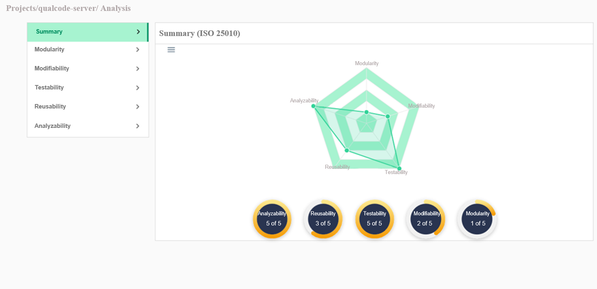
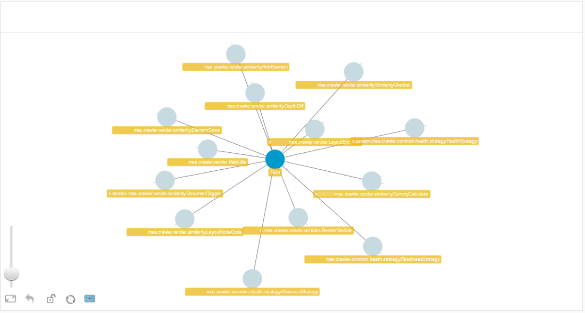
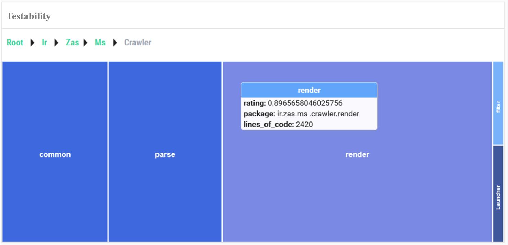
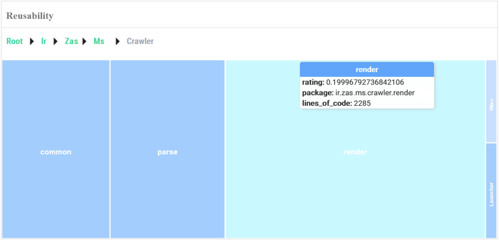
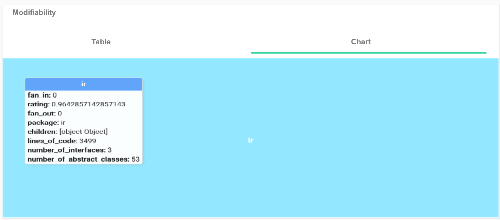
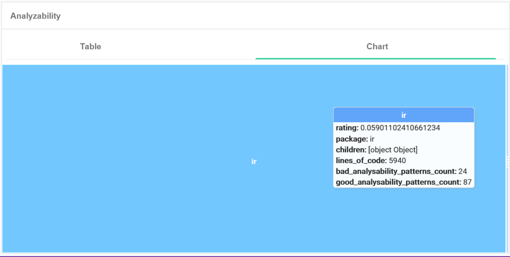
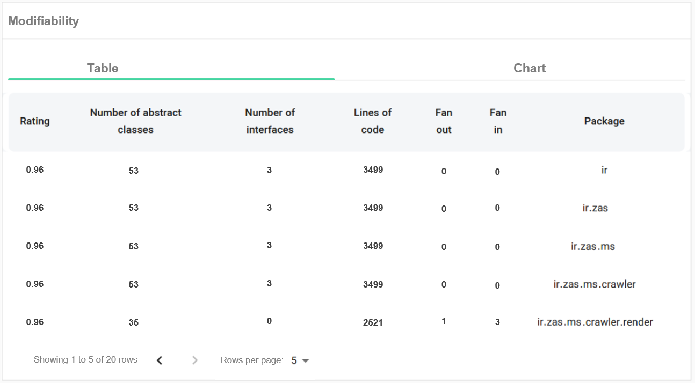
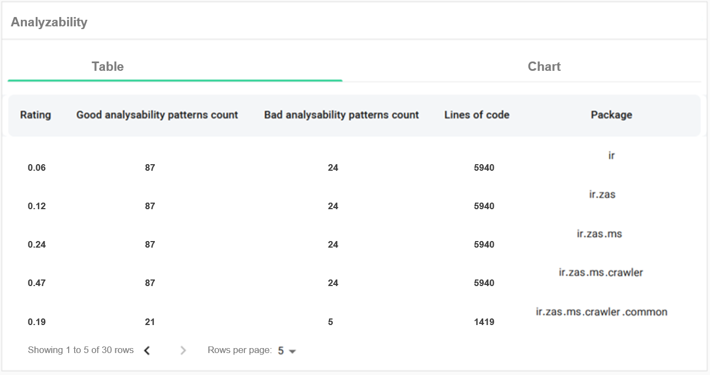

📄 **"An Innovative ISO-Based Computational Framework for Software Maintainability Assessment"**

The **QualCode** system combines ISO/IEC 25010 quality subcharacteristics with machine learning models to assess software maintainability across dimensions such as modularity, testability, reusability, analyzability, and modifiability. This repository provides tools and data for exploring and reproducing the visual and analytical components of our system.

## Repository Structure

├── docs/images/ # UI screenshots and figures used in the paper (Section 6)
├── data/ # Benchmark datasets used for training and evaluation
├── results/ # Output results, processed metrics, and analysis outputs
└── README.md # This file

# QualCode Visualization

This repository contains the visual interface elements and screenshots of our research paper entitled "An Innovative ISO-Based Computational Framework for Software Maintainability Assessment". These visuals demonstrate the analysis and visualization capabilities of the **QualCode** system.

## 🔍 Implemented Tools

The QualCode system offers diverse perspectives on the status of software components. The provided analysis details and impactful metrics for each subcharacteristic are viewable in suitable chart formats within the QualCode system. (Figure 1). The version analysis page provides an initial overview of the status of the five primary subcharacteristics, offering insights into the project's overall condition. In the sidebar tab, users can access detailed analysis information for each of these subcharacteristics.

**Figure 1: Call graph of project classes**

Regarding modularity, QualCode provides a visual representation of component call graphs, fostering in-depth exploration through interactive features such as clicking on graph nodes (illustrated in Figure 2). 

**Figure 2: Call graph of project classes**

Furthermore, the system employs heatmaps to visually depict subcharacteristic values, which can be traced down to the class level. Each mosaic in this heatmap represents a class or package. Notably, these heatmaps offer the capability to reveal influential metric values through a simple hover-over interaction (refer to Figures 3 to 6). For instance, in Fig.9, hovering the mouse pointer over a mosaic displays the testability metrics associated with that mosaic. Additionally, the color of each section indicates the quality score for testability in that section.

**Figure 3: Testability heatmap and display of its metrics down to the class level**

**Figure 4: Reusability heatmap and display of its metrics down to the class level**

**Figure 5: Modifiability heatmap and display of its metrics down to the class level**

**Figure 6: Analyzability heatmap and display of its metrics down to the class level**

Lastly, QualCode enhances the understanding of software quality by presenting detailed tables showcasing modifiability and analyzability metrics, further aiding users in their assessment and decision-making processes (demonstrated in Figures 7 and 8).

**Figure 7: Details of modifiability**

**Figure 8: Details of analyzability**

## 📂 Datasets

You can find the datasets used for model training and evaluation in the [`data/`](data/) directory. 

